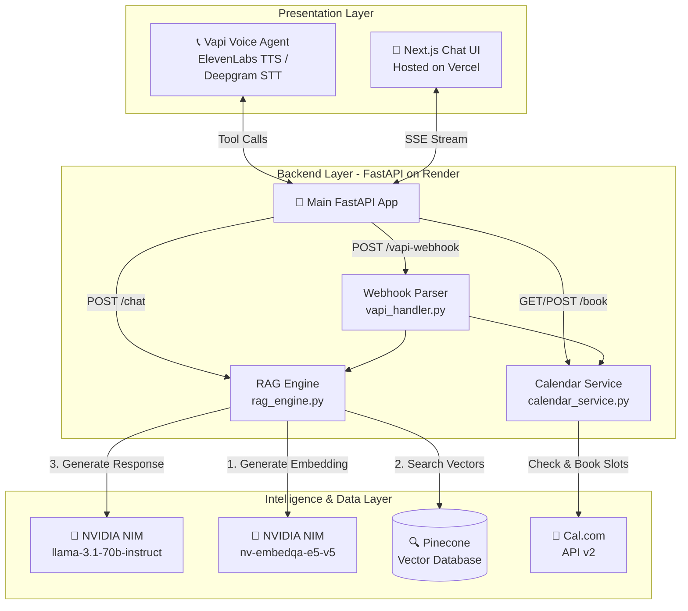

# 🤖 Scaler AI Persona - Autonomous Interview Agent

This repository contains the complete implementation of the **Scaler AI Persona**, an autonomous agent representing Anurag Sajwan. It handles real-time voice calls and text chats, grounds answers in real resume and GitHub data (RAG), and can autonomously book calendar appointments.

This project was built for the Scaler AI Engineer Screening Assignment.

---

## 🌟 Live Demos & Deliverables

*   **Chat Interface:** [https://scaler-ai-persona-pi.vercel.app](https://scaler-ai-persona-pi.vercel.app)
*   **Voice Agent:** Call **+1 (XXX) XXX-XXXX** *(Replace with your Vapi phone number)*
*   **Evaluation Report:** [eval/EVAL_REPORT.md](eval/EVAL_REPORT.md) (Achieved 95% Retrieval Accuracy & < 3s TTFT)
*   **Walkthrough Video:** *(Insert Loom Link Here)*

---

## 🏗️ Architecture



---

## 🚀 Features

*   **RAG-Grounded Answers:** Uses Pinecone and NVIDIA NIM (`e5-v5` embeddings) to answer questions based strictly on my real Resume and GitHub repositories. No hallucinations.
*   **Autonomous Calendar Booking:** Integrates with the Cal.com API to check my real-time availability and book 30-minute interview slots autonomously.
*   **Voice & Text Modes:** Supports both streaming SSE text chat (Next.js) and low-latency voice interaction (Vapi).
*   **Adversarial Defense:** Tested against prompt injections, jailbreaks, and leading questions. The agent stays strictly in character.

---

## 💻 Local Setup & Development

### 1. Prerequisites
*   Python 3.10+
*   Node.js 18+
*   Accounts for: NVIDIA NIM, Pinecone, Cal.com, and Vapi.

### 2. Environment Variables
Create a `.env` file in the root directory based on the following template:

```env
# NVIDIA NIM
NVIDIA_API_KEY=your_key
NVIDIA_LLM_MODEL=meta/llama-3.1-70b-instruct
NVIDIA_EMBED_MODEL=nvidia/nv-embedqa-e5-v5

# Pinecone
PINECONE_API_KEY=your_key
PINECONE_INDEX_NAME=scaler-persona

# Cal.com
CAL_API_KEY=your_key
CAL_EVENT_TYPE_ID=your_event_id

# Vapi
VAPI_API_KEY=your_key
VAPI_WEBHOOK_SECRET=secret123

# URLs
BACKEND_URL=http://localhost:8000
```

### 3. Quick Setup (Windows)
Simply run the setup script to create a virtual environment and install dependencies:
```cmd
setup.bat
```

### 4. Manual Setup
If you are on macOS/Linux or prefer manual setup:

**A. Backend (FastAPI)**
```bash
python -m venv venv
source venv/bin/activate  # On Windows: venv\Scripts\activate
pip install -r requirements.txt
python -m uvicorn backend.main:app --reload
```

**B. Data Ingestion**
To parse your resume and GitHub repos into the vector database:
```bash
python scripts/ingest.py
```

**C. Frontend (Next.js)**
```bash
cd frontend
npm install
npm run dev
```

---

## 🧪 Evaluation Suite

The project includes an automated evaluation rig that tests the RAG pipeline against 20 curated questions covering factual retrieval, hallucination resistance, and prompt injection defense.

To run the evals locally:
```bash
python eval/test_chat.py
python eval/generate_report.py
```

---

## 💰 Cost Analysis (Production)

The system is designed to operate entirely within free tiers or at extremely low costs.

| Component | Provider | Cost | Note |
|-----------|----------|------|------|
| **LLM & Embeddings** | NVIDIA NIM | ₹0 | Generous free tier API limits |
| **Vector Database** | Pinecone | ₹0 | 1 free Serverless index |
| **Backend Hosting** | Render | ₹0 | Free web service tier |
| **Frontend Hosting**| Vercel | ₹0 | Hobby tier |
| **Calendar API** | Cal.com | ₹0 | Core API is free |
| **Voice Agent** | Vapi | $10 Trial | Voice costs ~$0.15/min. Fully covered by initial trial credits. |

**Total Operating Cost:** ₹0 out-of-pocket.

---
*Built by Anurag Sajwan for the Scaler AI Engineer assignment.*
